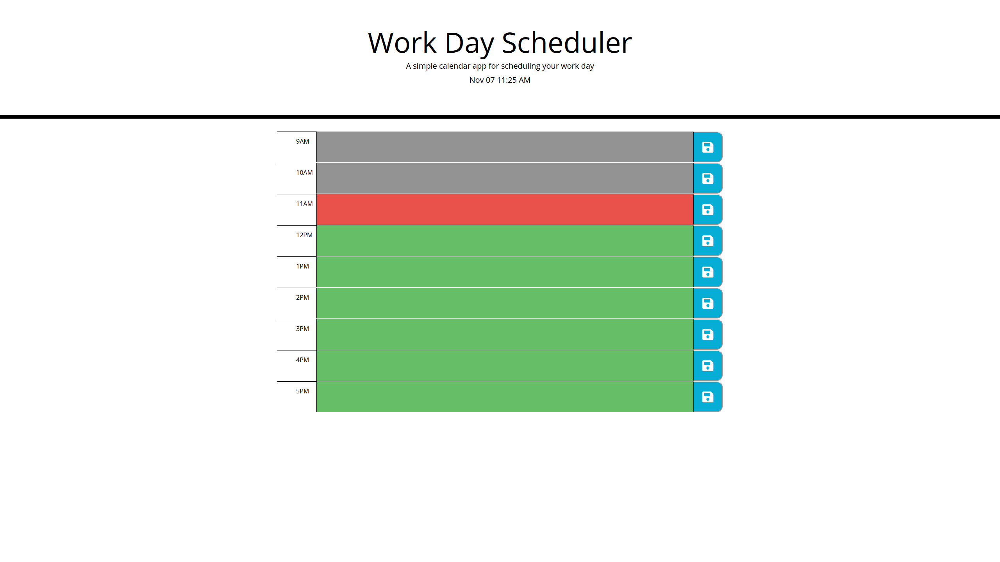

# Work Day Scheduler

## Description

A webpage for scheduling your tasks for the day. It presents the user with a schedule including common workday hours, and allows users to enter notes for each hour. This site can be used for planning out one's day at work (or school!).

This is my submission for the University of Miami Coding Boot Camp's week 5 challenge assignment.

## Usage

You can access the website at [this link](https://jaredschips.github.io/work-day-scheduler/).

It should look something like this:

Gray textboxes represent hours in the past, red means the current hour, and green means hours in the future. If you click on any of the textboxes, you can enter text, and pressing the blue button will save the text in the adjacent field across browser sessions.

## License

No License